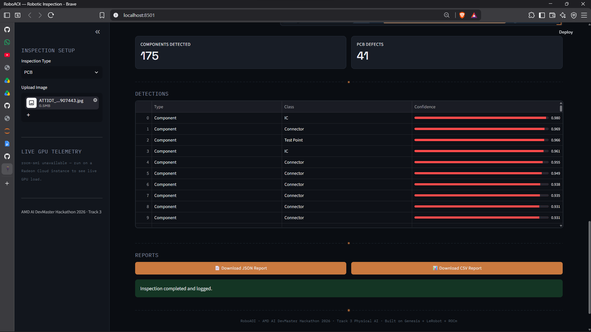
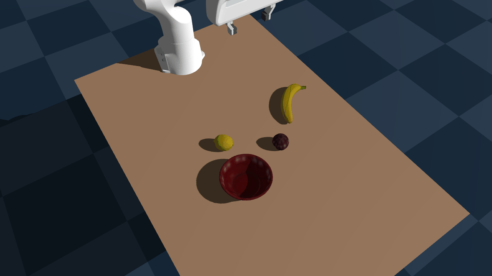
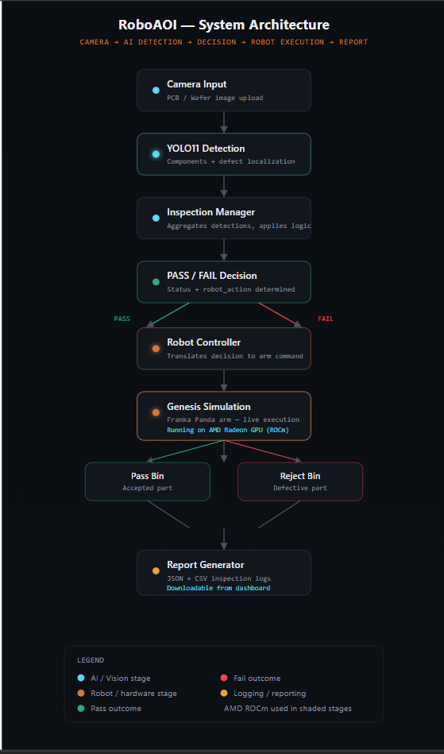
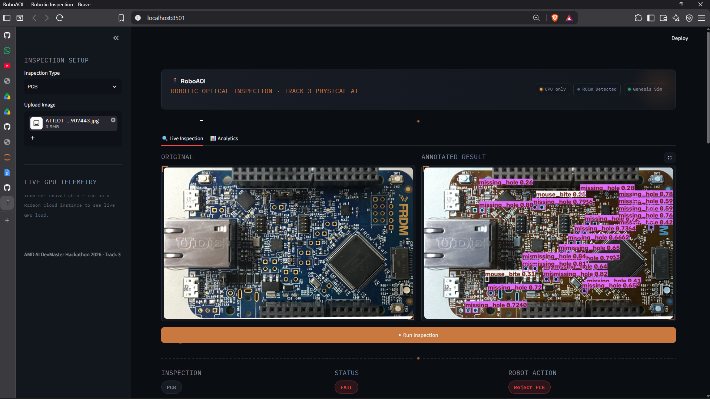
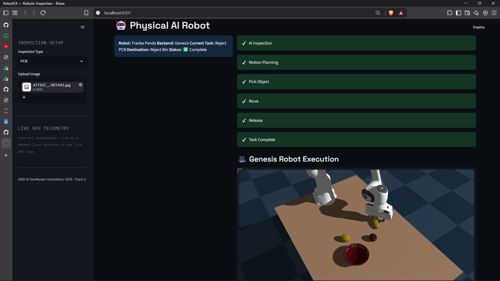
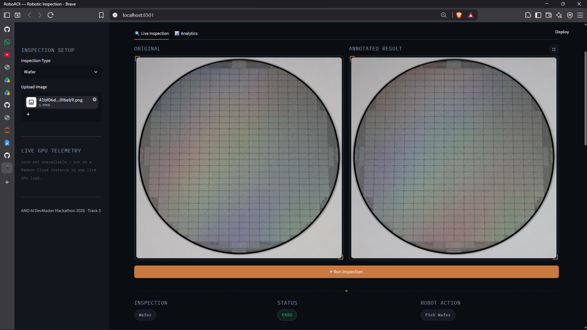

<div align="center">

# 🤖 RoboAOI

### AI-Powered Robotic Inspection & Sorting for PCB & Semiconductor Manufacturing

**Built for the AMD AI DevMaster Hackathon 2026 — Track 3: Physical AI**

[]()
[]()
[]()
[]()
[]()
[]()
[]()
[]()

</div>

<!-- Hero: full dashboard mid-inspection. Still needed: robot_demo.gif (short clip of the arm actually moving) -->
<p align="center">
  
</p>
<p align="center">
  
</p>

---

## 🎯 Overview

**RoboAOI** is an AI-powered robotic inspection platform for PCB and semiconductor manufacturing. It combines computer vision, defect detection, automated reporting, and Genesis-based robotic manipulation into a single, closed-loop Physical AI workflow.

Upload a PCB or wafer image, and RoboAOI runs it through a **YOLO11-based detector** to find components and defects, applies a **PASS/FAIL decision**, and **commands a Franka Panda arm in the Genesis simulator to physically sort the part in real time** — routing it to the pass or reject bin based on the inspection result. Every step is logged to a downloadable JSON/CSV inspection report, and the underlying models run on an **AMD Radeon GPU via ROCm**.

This directly targets Track 3's core theme — a perception-decision-control loop for robotic manipulation, with physics simulation, GPU-accelerated inference, and real-time execution all running through a single AMD Radeon GPU.

> **Why this project:** my background is in VLSI and semiconductor hardware. Automated Optical Inspection (AOI) is a real, expensive, and imperfect part of chip and PCB manufacturing today. RoboAOI closes the loop between "seeing" a defect and physically acting on it — not just detecting, but deciding and executing.

**The full pipeline, end to end:**

```
        Camera / Image
              │
              ▼
       YOLO11 Detection
              │
              ▼
      Inspection Manager
              │
              ▼
     PASS / FAIL Decision
              │
              ▼
       Robot Controller
              │
              ▼
   Genesis · Franka Panda
              │
        ┌─────┴─────┐
        ▼           ▼
      Pick        Sort
              │
              ▼
       Generate Report
```

---

## 🤖 Why Physical AI?

Most AI inspection tools stop at detection — they tell you a defect exists and leave the acting to a human. RoboAOI closes the perception-to-action loop: the same inspection result that flags a defect immediately triggers a robotic manipulation task in Genesis, sorting the part into the correct bin without human intervention in between. That closed loop — see, decide, *act* — is what makes this a Physical AI system rather than just a vision model with a UI on top.

---

## 🧩 Problem Statement

Manual and purely mechanical inspection/sorting on manufacturing lines suffers from:

- **Human fatigue** — inspector accuracy degrades over long shifts
- **Missed defects** — inconsistent standards between inspectors and shifts
- **Slow throughput** — manual inspection doesn't scale with production speed
- **High operational cost** — labor-intensive inspection scales poorly
- **Disconnected decisions** — most AI inspection tools stop at detection; they don't act on what they see

RoboAOI addresses the last point directly: detection and physical action happen in the same closed loop, not as two separate systems.

---

## ✨ Features

- ✅ **PCB defect & component detection** (YOLO11)
- ✅ **Wafer defect detection** (YOLO11)
- ✅ **Interactive Streamlit dashboard** — upload, inspect, review results
- ✅ **PASS / FAIL decision engine**
- ✅ **Live Genesis robot execution** — Franka Panda arm physically sorts the part based on the decision, in the same run
- ✅ **Automated inspection reports** — JSON + CSV, downloadable from the dashboard
- ✅ **AMD ROCm GPU acceleration** for inference
- ✅ **Deployed and tested on AMD Radeon Cloud**

See [Roadmap](#-roadmap) for what's next, kept separate so every ✅ above is something you can actually run today.

---

## 🏗️ System Architecture

<p align="center">
  
</p>

*(SVG diagram included in this repo at `assets/architecture.svg` — renders natively on GitHub, no external image host needed.)*

**Flow:** Camera input → YOLO11 detection → Inspection Manager → PASS/FAIL decision → Robot Controller → Genesis simulation (Franka Panda, live execution on AMD Radeon GPU) → Pass/Reject bin → JSON/CSV report.

---

## 🖼️ Dashboard

**PCB inspection — defect detected, part rejected:**

| Detection | Robot Execution |
|---|---|
|  |  |

**Wafer inspection — clean pass, routed to assembly:**

<p align="center">
  
</p>

---

## 🦾 Physical AI in Action

<p align="center">
  
</p>

The Franka Panda arm executes the sort decision live in Genesis — the same run that produced the PASS/FAIL call also moves the part to its bin. This is the core Physical AI claim of the project: detection and action are not decoupled.

*(Objects shown are proxy components from the base simulation environment, standing in for PCB/wafer parts and pass/reject bins — see [Roadmap](#-roadmap) for PCB-specific meshes.)*

---

## 📁 Repository Structure

```
RoboAOI/
├── roboaoi/
│   ├── yolo_detector.py          # YOLO11 defect/component detection
│   ├── model_manager.py          # Model loading & inference management
│   ├── inspection_manager.py     # Orchestrates detection → decision
│   ├── report_generator.py       # JSON/CSV inspection report generation
│   └── models/                   # Trained/loaded YOLO weights
│
├── dashboard/
│   └── app.py                    # Streamlit dashboard (main entry point)
│
├── franka_fruit_pick/            # Genesis + Franka Panda robot pipeline
│   ├── scene_config.py
│   ├── build_scene.py
│   ├── grasp_demo.py             # Robot controller + sort execution
│   └── ...
│
├── docs/
│   ├── assets/                   # Screenshots, GIF, architecture.svg
│   └── technical_report.pdf
├── reports/                      # Generated JSON/CSV inspection logs
├── docker/
└── README.md
```

---
## 📋 Submission Requirements Checklist

| Requirement | Status |
|---|---|
| Technical Report | ✅ [Download Technical Report](assets/RoboAOI_Technical_Report.pdf) |
| Project source code | ✅ This repository |
| Reproducibility README | ✅ This document (Installation + Run sections) |
| Demonstration video (3–5 min) | ✅ [Watch Demo Video](https://youtu.be/MiAQTwfIk68) |
| Supplementary materials | ✅ Architecture diagram, dashboard screenshots, robot execution GIF |

---

## 🛠️ Technology Stack

**Computer Vision** — YOLO11 · PyTorch

**Robotics & Simulation** — Genesis Physics Engine · Franka Panda robot model

**Interface** — Streamlit

**Hardware** — AMD Radeon GPU (Radeon Cloud instance) · ROCm 7.2.1

**Tooling** — Python 3.12 · `uv` / `pip` · Docker

---

## 🔄 Workflow

1. Upload a PCB or wafer image through the Streamlit dashboard
2. YOLO11 detects components and defects in the image
3. The Inspection Manager aggregates results into a PASS/FAIL decision
4. The Robot Controller sends that decision to the Genesis simulation
5. The Franka Panda arm physically picks and routes the part to the pass or reject bin — live, in the same run
6. A JSON and CSV inspection report is generated and made available for download

---

## ⚙️ Installation

```bash
git clone https://github.com/aanishhhh/RoboAOI.git
cd RoboAOI

pip install -r requirements.txt
# or: uv sync
```

> GPU-accelerated inference and the Genesis robot simulation are set up for an AMD ROCm environment — see `docs/RADEON_CLOUD_SETUP.md` for the full ROCm + Genesis installation steps if running on a fresh instance.

---

## ▶️ Run

```bash
streamlit run dashboard/app.py
```

Then, in the dashboard:
1. Select inspection type — **PCB** or **Wafer**
2. Upload an image
3. Click **Run Inspection**
4. Watch the detection result, PASS/FAIL decision, and the Genesis robot execute the sort
5. Download the generated JSON/CSV report

---

## 📈 Results

Real numbers from an actual inspection run on the live dashboard:

| Metric | Value |
|---|---|
| Components detected (PCB run) | 175 |
| PCB defects detected | 41 |
| Status | ❌ FAIL |
| Robot execution | ✅ Successful — pick, motion planning, move, release, task complete |
| Inference latency on AMD Radeon GPU | Not measured *(no latency metric currently surfaced by the dashboard — flagged as a roadmap item, not fabricated)* |

A second, independent wafer run returned **0 defects → PASS → routed to assembly conveyor**, shown in the [Dashboard](#-dashboard) section above — included to demonstrate the decision engine handles both outcomes correctly, not just the failure path.

**On GPU deployment:** the screenshots above were captured during local CPU testing (hence the "CPU only" badge visible in-app). The same YOLO11 + dashboard stack has also been run and verified on an AMD Radeon Cloud GPU instance via ROCm 7.2.1 — these are two separate validated environments, not a claim inferred from the CPU screenshots.

---

## 🎥 Demo

Watch the complete RoboAOI workflow: image upload → AI detection → PASS/FAIL decision → live Genesis robot sort → JSON/CSV report generation.

📹 **[Demo video —  https://youtu.be/MiAQTwfIk68]**

---

## 🔥 AMD Radeon GPU / ROCm Usage

- YOLO11 inference and the Genesis robot simulation both run on an AMD Radeon GPU via ROCm 7.2.1
- Deployed and validated on an AMD Radeon Cloud instance
- *(Add measured benchmark numbers here — inference latency, throughput — once collected)*

---

## 🏭 Future Industrial Deployment

RoboAOI is designed as a foundation for deploying AI-powered robotic inspection on real SMT production lines. This hackathon build proves the closed detect-decide-act loop in simulation; the path to a production line looks like:

- Real industrial camera integration (replacing manual image upload)
- Conveyor synchronization for continuous, unattended inspection
- PLC communication for integration with existing factory control systems
- Migration from the Franka Panda simulation to an industrial robot arm
- Multi-station inspection for higher line throughput

---

## 🏆 Track 3 Evaluation Criteria — How RoboAOI Maps

Laid out explicitly against the official rubric, so it's easy to check rather than take on faith:

| Criterion | Points | How RoboAOI addresses it |
|---|---|---|
| **Robot Capability Performance** | 30 | Closed-loop manipulation: YOLO11 perception → PASS/FAIL decision → Franka Panda pick-place-sort in Genesis, verified live on both a defective PCB (→ reject bin) and a clean wafer (→ assembly conveyor). See [Results](#-results). |
| **AMD Radeon GPU & ROCm Adoption** | 20 | YOLO11 inference and the Genesis simulation both run on ROCm 7.2.1; verified on an AMD Radeon Cloud GPU instance. See [AMD Radeon GPU / ROCm Usage](#-amd-radeon-gpu--rocm-usage). |
| **Innovation** | 20 | Closes the perception-to-action loop — the same inspection result that flags a defect directly drives the robot's sort decision, rather than stopping at detection like most inspection tools. See [Why Physical AI?](#-why-physical-ai) |
| **Application Value** | 20 | Targets a real, costly manufacturing problem (PCB/semiconductor AOI) with a concrete industrial deployment path. See [Future Industrial Deployment](#-future-industrial-deployment). |
| **Upstream Open-Source Contribution** | 10 | 🔜 In progress — see [Roadmap](#-roadmap). Not claimed as complete here; will be updated with the PR link once merged/opened. |

---


## 🗺️ Roadmap

Kept separate from Features so nothing above is overstated:

- 🔜 PCB/IC-specific fine-tuned dataset (vs. current general-purpose weights)
- 🔜 Defect localization refinement (tighter bounding boxes, more defect classes)
- 🔜 Docker image for one-command reproducibility
- 🔜 Open-source contribution back to the upstream Genesis/LeRobot reference pipeline
- 🔜 Real-robot deployment path (see Future Industrial Deployment above)
- 🔜 Multi-robot / multi-station coordination

---

## 🧱 Built With

YOLO11 · PyTorch · Genesis Physics Engine · Franka Panda · Streamlit · AMD ROCm · Python 3.12

---

## 📜 License

MIT License

---

## 🙏 Acknowledgements

RoboAOI's robot simulation pipeline builds on AMD's official Track 3 reference demo, [`franka_fruit_pick_demo`](https://github.com/wangxunx/franka_fruit_pick_demo) by wangxunx. Robot and object assets are sourced from the Genesis physics engine's bundled assets and the ManiSkill/YCB Object and Model Set — see upstream repositories for their original licenses.

---

## 👤 Author

**Anish** — [@aanishhhh](https://github.com/aanishhhh)

---

<div align="center">

## 🏆 Hackathon

**AMD AI DevMaster Hackathon 2026**
Track 3 — Physical AI Challenge

</div>